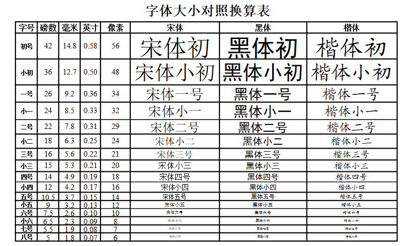

## 中英文字号大小换算表

表中：

- pt  磅或点数，是point简称 1磅=0.03527厘米=1/72英寸

- inch 英寸，1英寸=2.54厘米=96[像素](https://so.csdn.net/so/search?q=像素&spm=1001.2101.3001.7020)（分辨率为96dpi）
- px  像素，pixel的简称（本表参照显示器96dbi显示进行换算。像素不能出现小数点，一般是取小显示）。因此，相同字号在不同分辨率的显示器上显示大小不同。

转载于：[字体大小对照换算表-CSDN博客](https://www.cnblogs.com/bdqczhl/p/7354420.html)